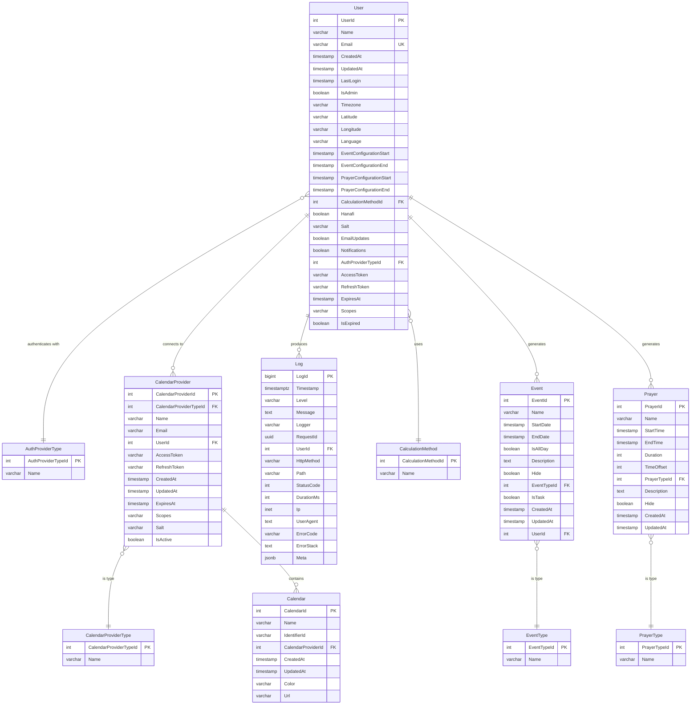

# Entity Overview and Design

## Table of Contents

- [[1. General Overview](https://claude.ai/chat/156e7e6c-7595-490b-948e-9463f83a26f1#1-general-overview)](#1-general-overview)
- [[2. Core Entities](https://claude.ai/chat/156e7e6c-7595-490b-948e-9463f83a26f1#2-core-entities)](#2-core-entities)
- [[3. Entity Relationship Diagram](https://claude.ai/chat/156e7e6c-7595-490b-948e-9463f83a26f1#3-entity-relationship-diagram)](#3-entity-relationship-diagram)
- [[4. Entity Interaction Flow](https://claude.ai/chat/156e7e6c-7595-490b-948e-9463f83a26f1#4-entity-interaction-flow)](#4-entity-interaction-flow)
- [[5. User Roles and Permissions](https://claude.ai/chat/156e7e6c-7595-490b-948e-9463f83a26f1#5-user-roles-and-permissions)](#5-user-roles-and-permissions)

---

## 1. General Overview

Islamic Calendar Sync is designed to help users generate and customize prayer times and Islamic events to help them prioritize their faith with their busy schedules. The system revolves around several core entities that interact to provide a seamless user experience.

[Link to Lucid ERD](https://lucid.app/lucidchart/87773400-ec8c-428c-81de-9944dd3b9ef5/edit?viewport_loc=261%2C773%2C4099%2C1568%2C0_0&invitationId=inv_48e52ce0-ccbe-4a0a-bef9-8a656b1e0510)

---

## 2. Core Entities

### User

Can login via email or OAuth, configure settings, generate personal Islamic calendar events and prayer times to their calendar provider.
Users contain an event configuration such as the range of dates to add Islamic calendar events. Users can specify start and end dates for the range they want to add holidays in their calendar provider.
Users contain location and language settings (`Timezone`, `Latitude`, `Longitude`, `Language`) stored directly on the user record to determine prayer time accuracy. Always asks the user to confirm their current location and language.
Users contain a prayer configuration for specifying the range for which to generate prayer times, method of Asr calculation, method of prayer time calculation (Hanafi), and other configuration options.
Users contain authentication provider information (`AuthProviderTypeId`) to specify which authentication method the user account uses (Google, Microsoft, Apple, or Email). OAuth credentials (access tokens, refresh tokens, expiry, scopes) are stored directly on the User for authentication purposes.

### AuthProviderType

The authentication method used by a user to log in (enum): Google, Microsoft, Apple, or Email. This specifies how the user authenticates with the application, separate from calendar integration providers.

### CalendarProvider

The calendar provider a user connects for calendar integration via API. Includes calendar-specific tokens, email, etc. A user is not required to have a calendar provider unless they want to use the API to create events in an external calendar system. This is separate from authentication - used specifically for calendar API access.

### CalendarProviderType

The type of calendar provider like Google Calendar, Microsoft Outlook, Apple Calendar, etc. (enum).

### Calendar

The calendar identifier in their calendar provider and have the credential so that if they save events, then it can go in their calendar provider. Users can make a calendar and have other users add events to it, but only they can make updates in the app and they can persist their calendar provider.

### CalculationMethod

The method of calculating prayer times such as per the Islamic Society of North America (ISNA), Muslim World League, Egyptian General Authority of Survey, etc. (enum).

### Prayer

Prayer time, duration, offset, description with virtues, type of prayer. Can be customized by users. Users can also make custom prayers.

### PrayerType

All the types of prayers as enum (Sunnah, Fard, Taraweeh, etc.).

### Event

An Islamic calendar event or task that has start and end date, description with virtues that are customizable. This can be Sunnah fasts, Ramadan, white days, etc. Users can customize these events, and they can save them to the back end. Users can also make custom events like Qur'an.

### EventType

The type of Islamic event like Sunnah Fasts, Ramadan, White Days, Eid, etc. (enum).

### Log

Server-side application logs (requests, responses, and errors) persisted in Postgres for troubleshooting and auditing. Sensitive fields (tokens, cookies, secrets, passwords) are redacted and request bodies/query strings are sanitized and truncated. Log contents are not returned to clients.

---

## 3. Entity Relationship Diagram

> **Note:** `Calendar`, `Prayer`, and `PrayerType` are defined but currently commented out in `init.sql` — they are planned for a future implementation phase.

---

## 4. Entity Interaction Flow

1. **User** authenticates via **AuthProviderType** (Google, Microsoft, Apple, or Email). OAuth credentials (access tokens, refresh tokens) are stored directly on the **User** for authentication purposes. User can optionally connect with a **CalendarProvider** for calendar API integration (separate from authentication), then specifies language and location in **Settings**.

2. **User** triggers calendar generation which creates **Prayer** times and **Event** entries based on their configurations.

3. **User** can preview **Prayer** times and **Events** before final export.

4. Islamic calendar events from **Event** and prayer times from **Prayer** are exported to their **Calendar** via **CalendarProvider**.

---

## 5. User Roles and Permissions

### Registered User

**Description**: Authenticated user with full access to personal features with persistence.

**Permissions**:

- Save prayer settings permanently
- Create and manage custom events and prayers
- Create calendar subscriptions
- Preview calendar with the events from their calendar provider for scheduling
- Connect to calendar providers via OAuth for calendar API integration
- Access personal dashboard and history
- Persist all configurations and customizations

---

### Admin User

**Description**: System administrator with management capabilities.

**Permissions**:

- Everything Registered User can do
- Add/edit/delete default Islamic events and prayer times
- View user analytics and usage statistics
- Manage user accounts and permissions
- Monitor system performance and errors
- Update calculation methods and formulas
- Manage calendar provider integrations
- Export system data and reports
- Access admin dashboard with system-wide controls

---

## Notes

- **Flexibility**: Users can choose to use the system without connecting a calendar provider by downloading ICS files or using subscription URLs.
- **Customization**: Both prayers and events can be customized with descriptions, times, and visibility settings.
- **Privacy**: Offline guest mode uses temporary browser-local storage, while registered users have persistent, server-backed storage of their preferences.
- **Scalability**: The enum-based approach for types allows easy addition of new prayer types, event types, authentication provider types, and calendar provider types.
- **Separation of Concerns**: Authentication (via AuthProviderType) is separate from calendar integration (via CalendarProvider). OAuth credentials are stored on the User for authentication, while CalendarProvider is specifically for calendar API access.
