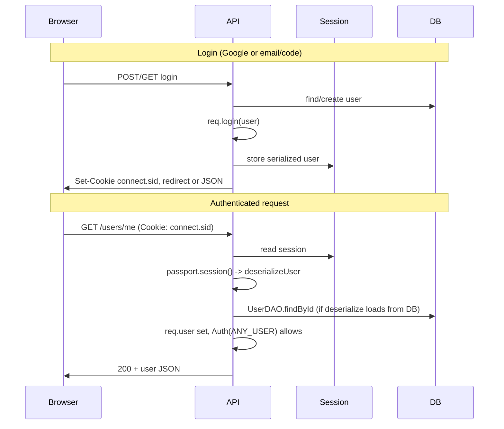

## Google OAuth Strategy and Authentication

This page explains how Google OAuth2 is integrated with Passport.js and how it interacts with the application's **session-based** authentication. It also documents **future plans** for JWT-based authentication and other strategies, so you can see both what is live today and what is being designed.

---

### Current implementation: Google OAuth + Passport sessions

At the moment, the web app uses **Passport's session strategy** for all browser-based authentication:

- **Frontend**
  - **User context** (`UserContext`): Single source of truth for the logged‑in user. Screens consume this context instead of hardcoding user data.
  - **Auth context** (`AuthContextProvider`): On app load, calls `APIClient.getCurrentUser()` (HTTP `GET /users/me`) to resolve the current authenticated user from the backend.
  - **App wiring** (`App.jsx`): Wraps the router with both `UserProvider` and `AuthContextProvider`, so all routed components can access shared authentication and user state.
  - **API client** (`APIClient`): Exposes `getCurrentUser()`, `getGoogleLoginUrl()`, `sendVerificationCode()`, `verifyCode()`, and `logout()`. All of these ultimately rely on the browser sending the session cookie.
  - **Login page**: The Google login button reads the URL from `APIClient.getGoogleLoginUrl()` and redirects the browser to `APP_API_URL/auth/google/login`. This is the single entry point into the Google OAuth2 flow.

- **Backend**
  - **Database access**: All SQL is encapsulated in DAOs built on top of `DBConnection.js`, which exports `query`, `getConnection`, and `pool`.
  - **User DAO** (`UserDAO`): Handles lookups by email or ID, user creation, and updates to fields such as `LastLogin`, language, calculation method, Hanafi flag, and notification configuration. It maps directly to the `USERS` table as documented in `_wiki/entity_overview_and_design.md`.
  - **Provider DAOs**:
    - `ProviderDAO` manages the `PROVIDER` table (creating providers, finding by user and type, updating tokens, expiry, and flags).
    - `ProviderTypeDAO` reads provider types from the `PROVIDER_TYPE` table.
    - `ProviderType.js` defines an enum‑like mapping for known providers (Google, Microsoft, Apple, Cal.com) and their IDs, which must exist in `PROVIDER_TYPE`.
  - **Google API client** (`GoogleApiClient.js`): Coordinates user/provider persistence. Given a Google profile and OAuth tokens, it:
    - Finds or creates the corresponding `USERS` row.
    - Ensures a `PROVIDER` row exists for the Google provider type.
    - Updates tokens, scopes, and `LastLogin`.
    - Interacts only with `UserDAO` and `ProviderDAO`, never executing raw SQL directly.
  - **Passport.js Google OAuth** (`GoogleAuth.js`):
    - Registers a `passport-google-oidc` `GoogleStrategy`.
    - Uses `GoogleApiClient.findOrCreateUserFromGoogleProfile()` in the verify callback to link Google accounts to internal users.
    - After a successful callback, calls `req.login(user, cb)` to establish a **session-based** login rather than issuing a JWT.
    - Exposes the OAuth routes under `/auth/google`:
      - `GET /auth/google/login` – starts the Google OAuth2 flow.
      - `GET /auth/google/redirect` – handles the callback, stores tokens in the provider tables, and establishes the session.
  - **Routing and middleware**:
    - `Routes.js` mounts the Google router with `router.use("/auth/google", GoogleAuthRouter)` and protects secure routes (such as `/users/me`) with `AuthMiddleware`.
    - `index.js` initializes `passport`, uses `cookie-parser`, configures `express-session`, and mounts routes. `passport.session()` restores `req.user` from the session on each request.
    - `AuthMiddleware` no longer reads or verifies JWTs; it simply checks `req.isAuthenticated()` / `req.user` and then enforces role rules.

---

### How cookies work today (session cookie)

The only cookie required for normal web usage is the **session cookie** managed by `express-session` (by default named `connect.sid`):

- **Creation**
  - When a login flow succeeds (Google OAuth or email+code), the server calls `req.login(user, cb)`.
  - `passport` serializes a small identifier (e.g. `{ id: user.userid }`) into the session store.
  - `express-session` sends a `Set-Cookie` header for `connect.sid` to the browser.

- **Configuration**
  - The session cookie is configured in `api/src/index.js` with:
    - `sameSite: "lax"` for CSRF protection.
    - `secure: process.env.NODE_ENV === "production"` so it is HTTPS-only in production.
    - `maxAge: 7 days`, which defines the login lifetime.
  - The cookie is HTTP-only by default, so JavaScript on the frontend cannot read it directly.

- **Usage on requests**
  - The browser automatically attaches `connect.sid` to any request to the API origin.
  - `HTTPClient` always uses `credentials: 'include'`, ensuring the session cookie is sent on all API calls (e.g. `/users/me`, `/users/logout`).
  - On each request, `passport.session()` reads the session, deserializes the full user via `deserializeUser`, and populates `req.user`.
  - `AuthMiddleware` then:
    - Returns `401 Unauthorized` if there is **no** valid session (`!req.isAuthenticated()` or `!req.user`).
    - Applies role rules (`ANY_USER`, `SAME_USER`, `ADMIN`) when a user is present.

- **Logout**
  - `/users/logout` calls `req.logout(cb)` to clear Passport's session state and uses `res.clearCookie('connect.sid', ...)` to explicitly clear the browser's session cookie.
  - On the frontend, `APIClient.logout()` calls this endpoint and the UI clears any local user state.

From the frontend’s point of view, authentication is fully cookie/session-based: there are no explicit JWTs or Bearer tokens to manage in the browser.

---

### Future plans: JWT-based authentication and additional strategies

Although the current web app is purely session-based, the codebase and this wiki also define a **planned JWT-based cookie strategy** and support for other authentication clients (e.g. mobile apps or token-based integrations). This section keeps the existing JWT design notes, but treats them as **future work**, not as the current behavior.

> The rest of this section describes a planned JWT-based cookie strategy; the current production implementation uses Passport sessions as described above.

#### Cookies, JWT, and why we plan to use them

Browsers do not invent cookies; they only store cookies that servers send through the `Set-Cookie` response header. In the planned JWT-based flow, cookies would carry the app’s JWT so authenticated requests could be made without manually attaching tokens on the frontend.

##### How the JWT cookie would be set

In the Google OAuth redirect handler, the backend would sign a JWT and set a `token` cookie:

```javascript
res.cookie("token", token, {
  httpOnly: true, // JavaScript can't read this (security)
  secure: process.env.NODE_ENV === "production", // HTTPS only in prod
  sameSite: "lax", // CSRF protection
  maxAge: 7 * 24 * 60 * 60 * 1000, // 7 days
});
```

This sends a `Set-Cookie` header in the HTTP response. The browser stores the cookie and then automatically includes it on subsequent requests to the same origin in the `Cookie` header.

##### How the JWT cookie would be read

On the backend, `AuthMiddleware` would access the token via `req.cookies.token`:

```javascript
const token = req.cookies?.token;
```

Express itself does not parse cookies; `cookie-parser` is added in `index.js` so that the raw `Cookie` header is transformed into the `req.cookies` object:

```javascript
app.use(cookieParser()); // Parses "Cookie: token=abc123" → req.cookies.token = "abc123"
```

##### Why use cookies instead of `localStorage`/`sessionStorage`?

- **Security**: The `httpOnly: true` flag prevents JavaScript from reading the JWT, reducing exposure to XSS.
- **Automatic sending**: Cookies are sent by the browser with every matching request; no manual header wiring is needed in each API call.
- **CSRF protection**: `sameSite: "lax"` helps mitigate CSRF attacks by limiting cross‑site cookie sending.

##### Why the app would issue its own JWT

After Google completes OAuth, the app would not rely on Google’s tokens for authentication:

- Google’s access tokens are intended for Google APIs, not for identifying users in this application.
- The app needs its own token that encodes an internal user identifier (e.g. `userId`) and adheres to internal expiry rules.
- By creating its own JWT, the backend fully controls the payload, lifetime, and validation logic.

---

### Complete Google OAuth2 flow

#### Overview

The system uses **Passport.js with `passport-google-oidc`** to run the OAuth2 authorization code flow end‑to‑end. During the flow:

- Google access and refresh tokens are obtained and stored in the database.
- The application’s own JWT is created and stored in an HTTP‑only cookie to authenticate subsequent API calls.
- Frontend contexts (`AuthContext` and `UserContext`) consume the `/users/me` endpoint, which in turn uses this JWT to determine the current user.

#### Google Cloud Console configuration

To support the flow, the following configuration is required:

1. **Create OAuth 2.0 credentials**
   - Open the Google Cloud Console and go to “APIs & Services” → “Credentials”.
   - Create an “OAuth 2.0 Client ID” of type **Web application**.

2. **Authorized redirect URIs**
   - Development: `http://localhost:YOUR_API_PORT/auth/google/redirect`
   - Production: `https://yourdomain.com/auth/google/redirect`
   - The path must match **exactly**; Passport validates the redirect against this value.

3. **Authorized JavaScript origins**
   - Development: `http://localhost:5000` (the nginx proxy port in this setup).
   - Production: `https://yourdomain.com`

4. **Environment variables**

```bash
GOOGLE_CLIENT_ID=your-client-id.apps.googleusercontent.com
GOOGLE_CLIENT_SECRET=your-client-secret
```

---

### OAuth flow step‑by‑step

#### Step 1: User initiates login from the frontend

The login page uses the API client to obtain the Google login URL:

```
User clicks "Google" button → Frontend calls APIClient.getGoogleLoginUrl()
→ Browser redirects to: GET /auth/google/login
```

`/auth/google/login` is implemented in `GoogleAuth.js` and delegates to Passport.

#### Step 2: Backend redirects to Google

The login route calls Passport’s Google strategy:

```
Backend (GoogleAuth.js) calls passport.authenticate("google", {
  scope: ["profile", "email", "https://www.googleapis.com/auth/calendar"],
  accessType: "offline",  // REQUIRED for refresh tokens
  prompt: "consent"        // Forces consent screen
})
→ User is redirected to Google's OAuth consent screen
```

Key configuration:

- `accessType: "offline"` – required to receive refresh tokens.
- `prompt: "consent"` – forces the consent screen, ensuring a refresh token is returned when needed.
- `scope` – defines which details and APIs (profile, email, calendar) the app can access.

#### Step 3: User grants permission

Once the user approves access:

```
User authenticates with Google → User grants permissions
→ Google redirects back to: GET http://localhost:5000/api/auth/google/redirect?code=AUTHORIZATION_CODE
  (nginx proxy receives this, rewrites to /auth/google/redirect, forwards to backend)
```

At this point, Google has not yet returned tokens; it sends an **authorization code** in the query string. The public callback URL is `http://localhost:5000/api/auth/google/redirect`, but after nginx rewrite, the Node.js backend receives `/auth/google/redirect`.

#### Step 4: Passport exchanges the code for tokens

Passport’s middleware intercepts the callback and performs the code‑for‑token exchange:

```
Passport middleware intercepts /auth/google/redirect
→ Passport automatically exchanges authorization code for tokens:
   POST https://oauth2.googleapis.com/token
   {
     code: AUTHORIZATION_CODE,
     client_id: GOOGLE_CLIENT_ID,
     client_secret: GOOGLE_CLIENT_SECRET,
     redirect_uri: "/auth/google/redirect",
     grant_type: "authorization_code"
   }
→ Google responds with:
   {
     access_token: "ya29.a0...",
     refresh_token: "1//0g...",  // Only if accessType: "offline"
     expires_in: 3599,
     token_type: "Bearer",
     scope: "profile email https://www.googleapis.com/auth/calendar",
     id_token: "eyJ..."
   }
```

This exchange is handled entirely by Passport; no custom code is required for the HTTP POST to Google.

#### Step 5: Verify callback links tokens and users

After tokens are obtained, Passport invokes the strategy’s verify callback (in `GoogleAuth.js`):

```
Passport calls our verify callback (in GoogleAuth.js):
  async (req, issuer, profile, tokens, cb) => {
    // tokens = { access_token, refresh_token?, expires_in, scope, ... }
    // profile = { emails: [...], displayName: "...", ... }

    const { user, provider } =
      await GoogleAPIClient.findOrCreateUserFromGoogleProfile(profile, tokens);

    req.googleTokens = tokens;      // Store for redirect handler
    req.googleProvider = provider;  // Store for redirect handler
    cb(null, user);
  }
```

Within this step:

1. `GoogleAPIClient.findOrCreateUserFromGoogleProfile(profile, tokens)` coordinates with `UserDAO` and `ProviderDAO`.
2. The user is created or found in the `USERS` table.
3. A corresponding `PROVIDER` row is created or updated for the Google provider type.
4. Tokens are stored or updated in `PROVIDER`:
   - `access_token` → `accesstoken`
   - `refresh_token` → `refreshtoken` (existing value is preserved if Google omits it on a subsequent login).
   - `expires_in` → converted into an absolute `expiresAt`.
   - `scope` → stored in the `scopes` column.
5. Tokens and provider details are attached to `req` for later use in the redirect handler.

#### Step 6: Redirect handler issues the JWT and cookie

After the verify callback successfully resolves the user, the redirect handler:

```
Redirect handler (async function) runs:
  1. Retrieves tokens from req.googleTokens
  2. Updates provider tokens in database (if needed)
  3. Issues our own JWT: jwt.sign({ userId: user.userid }, ...)
  4. Sets JWT as HTTP-only cookie
  5. Redirects to frontend: res.redirect(APP_BASE_URL)
```

Two distinct categories of tokens exist after this step:

1. **Google OAuth tokens** (persisted in the `PROVIDER` table)
   - `access_token` – used to call the Google Calendar API.
   - `refresh_token` – long‑lived, used to obtain fresh access tokens.
   - These tokens are only for Google API calls (e.g. creating calendar events).

2. **Application JWT** (stored in the `token` cookie)
   - Encodes `{ userId: user.userid }`.
   - Used for all app‑level authentication and authorization.
   - Automatically attached to backend requests via the browser’s cookie mechanism.

#### Step 7: Frontend contexts consume `/users/me`

Once the user is redirected back to the frontend:

```
Frontend receives redirect → Cookie is automatically set
→ AuthContext calls APIClient.getCurrentUser()
→ Backend reads JWT from cookie → Returns user data
→ UserContext is populated → User is logged in
```

The cookie is scoped to `localhost:5000` (or your production domain), so it is included with subsequent `/api/*` requests. `AuthMiddleware` validates the JWT and loads the user, and the response from `/users/me` hydrates the frontend `UserContext`.

---

### Token storage and usage summary

- **Google tokens (`PROVIDER` table)**
  - Persisted when OAuth completes.
  - Used by background jobs or API endpoints that call Google Calendar.
  - Refresh tokens are preserved across logins (Google may only send them on the first consent or with `prompt: "consent"`).
  - Access tokens expire and are renewed using the refresh token.

- **App JWT (`token` cookie)**
  - Set as an HTTP‑only cookie after OAuth.
  - Used on all protected routes such as `/users/me`.
  - Verified by `AuthMiddleware` for each request.
  - Independent from Google tokens; it represents authentication within this application.

---

### End‑to‑end code flow diagram

The following diagram shows how the browser, nginx proxy, backend, and Google interact across the full login and user‑loading flow:

```
Frontend                    Nginx Proxy              Backend                    Google
   │                          │                          │                          │
   │── GET /api/auth/google/login │                      │                          │
   │─────────────────────────>│                          │                          │
   │                          │── GET /auth/google/login │                          │
   │                          │─────────────────────────>│                          │
   │                          │                          │── GET /oauth2/auth ─────>│
   │                          │                          │  (redirect_uri:          │
   │                          │                          │   localhost:5000/api/...)│
   │                          │                          │                          │
   │                          │                          │<─── Redirect with code ──│
   │                          │                          │                          │
   │                          │<─── GET /api/auth/google/redirect?code=...          │
   │                          │                          │                          │
   │                          │── GET /auth/google/redirect?code=...                │
   │                          │─────────────────────────>│                          │
   │                          │                          │── POST /token ──────────>│
   │                          │                          │  (exchange code)         │
   │                          │                          │                          │
   │                          │                          │<─── access_token ────────│
   │                          │                          │    refresh_token         │
   │                          │                          │                          │
   │                          │                          │── verify callback ───────│
   │                          │                          │  (store tokens in DB)    │
   │                          │                          │                          │
   │<─── Redirect + Cookie ───│<─── Redirect + Cookie  ──│                          │
   │    (JWT token)           │    (JWT token)           │                          │
   │                          │                          │                          │
   │── GET /api/users/me ────>│── GET /users/me ────────>│                          │
   │    (with cookie)         │    (with cookie)         │── Validate JWT ──────────│
   │                          │                          │── Return user ──────────>│
   │                          │<─── User data ───────────│                          │
   │<─── User data ───────────│                          │                          │
```

---

### Key implementation details and configuration

1. **`passReqToCallback: true`**  
   Enables the verify callback to access `req`, which is used to attach `googleTokens` and `googleProvider` for later steps.

2. **`accessType: "offline"` and `prompt: "consent"`**  
   Required to reliably receive and refresh long‑lived Google refresh tokens.

3. **Token preservation**  
   If Google does not send a new refresh token on a subsequent login, the system keeps the existing `refreshtoken` in the `PROVIDER` row instead of overwriting it with `null`.

4. **Error handling**  
   Failures in the OAuth flow or verify callback result in a redirect back to the login page with an error indicator in the query string, allowing the frontend to surface a friendly message.

5. **Nginx proxy**  
   Frontend calls `GET /api/auth/google/login`; nginx forwards that to the backend as `/auth/google/login` and similarly rewrites `/api/auth/google/redirect` to `/auth/google/redirect`.

6. **Core environment variables**
   - `APP_API_URL` – backend URL seen by the frontend (for example, `http://localhost:5000/api` via proxy, or `/api` when served from the same origin).
   - `APP_BASE_URL` – base URL of the frontend (for example, `http://localhost:5000`).
   - `GOOGLE_CALLBACK_URL` – full callback URL registered in Google Cloud (for example, `http://localhost:5000/api/auth/google/redirect`).

---

### Conceptual session flow (mermaid diagram)

While this implementation authenticates with a JWT stored in a cookie, the conceptual flow of establishing a logged‑in browser session is captured by the following diagram. It is useful for understanding how a browser, API, session layer, and database interact when a user logs in and later queries `/users/me`:



Even when the internal mechanics use a JWT cookie rather than a Passport session store, the core ideas in this diagram still apply: the browser keeps a cookie set by the server, the API uses that cookie to look up the authenticated user on each request, and user data is ultimately loaded from the database via DAOs.
