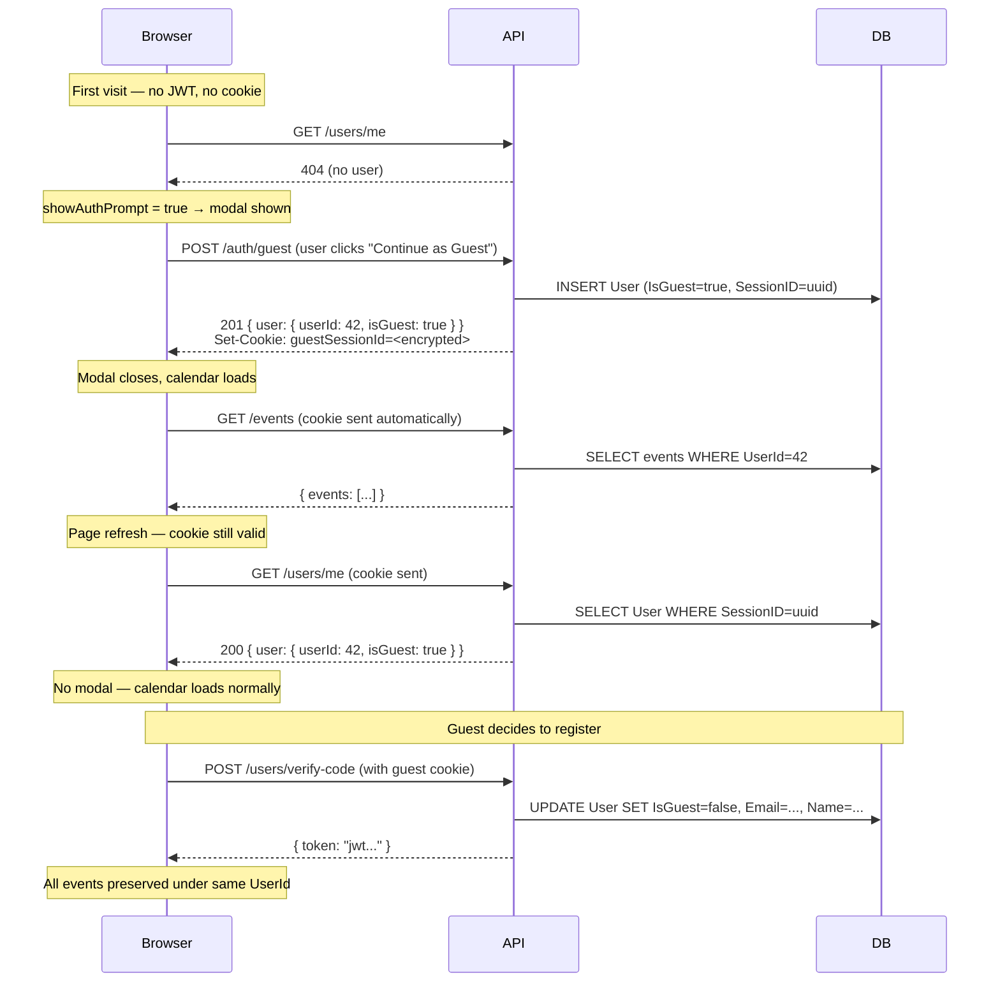

# Guest Authentication

## Overview

Guest authentication allows unauthenticated users to use the calendar without registering. Unlike a typical auto-session approach, guest sessions are **only created when the user explicitly chooses "Continue as Guest"** from a login prompt. This prevents orphan user records and gives the user a clear choice upfront.

There are three user states:

| State                      | How identified                         | `req.user` set by                   |
| -------------------------- | -------------------------------------- | ----------------------------------- |
| **Registered (JWT)**       | `Authorization: Bearer <token>` header | `optionalJwtAuth` middleware        |
| **Guest (returning)**      | Encrypted iron-session cookie          | `guestSessionMiddleware`            |
| **Anonymous (no session)** | No JWT, no cookie                      | Neither — `req.user` is `undefined` |

---

## Architecture

### Express Middleware Pipeline

```
cookieParser → express-session → passport.initialize → optionalJwtAuth → guestSessionMiddleware → requestLogger → routes
```

Defined in `api/src/index.js`. The two authentication layers run in order:

1. **`optionalJwtAuth`** — If a valid `Authorization: Bearer <token>` header is present, decodes the JWT and sets `req.user`. Otherwise leaves it `undefined`. Never sends 401.
2. **`guestSessionMiddleware`** — If `req.user` is already set (JWT succeeded), skips. Otherwise decrypts the iron-session cookie and looks up the guest user by session ID. If found, sets `req.user`. If no valid cookie exists, **does nothing** — `req.user` stays `undefined`.

The middleware does **not** auto-create guest users. That only happens via the explicit `POST /auth/guest` endpoint.

### Session Cookie (iron-session)

Guest sessions use [iron-session](https://github.com/vvo/iron-session) for encrypted, signed cookies:

- **Encryption:** AES-256-CBC with a fresh IV on every save
- **Integrity:** HMAC-SHA256 signature
- **Cookie flags:** `HttpOnly`, `Secure` (production only), `SameSite=Lax`
- **Max age:** 30 days
- **Cookie name:** `guestSessionId` (configurable via `guestSessionConfig`)

The cookie payload contains only `{ guestSessionId: "<uuid>" }` — an opaque session ID that maps to a User row in the database. The user's primary key is never exposed in the cookie.

### Config

In `api/src/config.js`:

```js
export const guestSessionConfig = {
  COOKIE_NAME: "guestSessionId",
  SECRET: process.env.GUEST_SESSION_SECRET || sessionConfig.SECRET,
  COOKIE_MAX_AGE_MS: 30 * 24 * 60 * 60 * 1000, // 30 days
};
```

The `GUEST_SESSION_SECRET` must be at least 32 characters (required by iron-session for AES-256). Generate one with:

```bash
node -e "console.log(require('crypto').randomBytes(64).toString('hex'))"
```

---

## Backend Flow

### `POST /auth/guest` — Create Guest Session

**File:** `api/src/endpoints/users/CreateGuestSession.js`
**Route:** `router.post("/auth/guest", CreateGuestSession)` (no `Auth()` wrapper — caller has no credentials)

Called when the user clicks "Continue as Guest" on the frontend. The endpoint is idempotent:

1. If `req.user` exists and is **not** a guest (JWT user) → return `400`.
2. If `req.user` exists and **is** a guest (middleware restored from cookie) → return the existing guest user.
3. If a valid `guestSessionId` exists in the cookie but the middleware didn't set `req.user` → look up the user in the DB. If found, return it.
4. Otherwise → generate a `crypto.randomUUID()`, call `UserDOA.createGuestUser(sessionId)`, save the session ID to the encrypted cookie, return the new guest user with status `201`.

### `GuestSessionMiddleware` — Restore Existing Sessions

**File:** `api/src/middleware/GuestSessionMiddleware.js`

Runs on every request. Only **restores** existing guest sessions — never creates new ones:

1. If `req.user` is set (JWT) → skip.
2. Decrypt the iron-session cookie.
3. If `session.guestSessionId` exists → look up user via `UserDOA.findBySessionId()`.
   - Found → set `req.user`, continue.
   - Not found (revoked/deleted) → destroy the stale cookie, continue without `req.user`.
4. No cookie → continue without `req.user`.

The `sessionOptions` object is exported from this file so `CreateGuestSession.js` can reuse it.

### Database

Guest users are stored in the `User` table:

| Column      | Value                             |
| ----------- | --------------------------------- |
| `IsGuest`   | `true`                            |
| `SessionID` | UUID (from `crypto.randomUUID()`) |
| `Email`     | `NULL`                            |
| `Name`      | `NULL`                            |

Created via `UserDOA.createGuestUser(sessionId)`. Looked up via `UserDOA.findBySessionId(sessionId)`.

### Guest-to-Registered Conversion

When a guest registers (Google OAuth or email verification), the existing guest User row is upgraded in place:

- `IsGuest` → `false`
- `Email`, `Name`, etc. populated from the auth provider
- `SessionID` cleared

This preserves the guest's `UserId` and all their events. Handled in `passport.js` (Google OAuth) and `LoginUser.js` (email verify).

---

## Frontend Flow

### 1. Initial Session Check (`UserContext.jsx`)

On mount, `UserProvider` calls `GET /users/me`:

- **JWT user or returning guest (cookie exists):** Backend returns `{ success: true, user: { userId, isGuest, ... } }`. The user state is set and `ready` becomes `true`.
- **Anonymous (no JWT, no cookie):** Backend returns `404`. User state stays as `defaultUser` (with `userId: null`), `ready` becomes `true`.

The derived state `showAuthPrompt` is `true` when `ready && !user.userId`.

### 2. Auth Prompt Modal (`LoginPromptModal.jsx`)

Rendered in `MainLayout.jsx`. The modal opens when `showAuthPrompt && !isHome && !dismissed`:

- **Not shown on the home page** (`/`) — visitors can browse freely.
- **Shown on `/calendar`, `/settings`, etc.** — any page that needs a user session.

The modal offers three options:

| Button                   | Action                                                              |
| ------------------------ | ------------------------------------------------------------------- |
| **Continue with Google** | Redirects to `GET /auth/google/login` (OAuth flow)                  |
| **Sign in with Email**   | Navigates to `/auth/login`                                          |
| **Continue as Guest**    | Calls `POST /auth/guest` → sets user state → modal closes           |
| **Cancel**               | Dismisses the modal for the current page (re-appears on navigation) |

### 3. Guest Session Created

When the user clicks "Continue as Guest":

1. `LoginPromptModal` calls `APIClient.createGuestSession()` → `POST /auth/guest`.
2. Backend creates a guest user, sets the encrypted session cookie.
3. The response `{ success: true, user: { userId, isGuest: true, ... } }` is passed to `onGuestLogin`.
4. `MainLayout` calls `setUser(createUser(userData))`, which updates `UserContext`.
5. `showAuthPrompt` becomes `false` → modal closes.
6. `CalendarContext` sees `user.userId` is now set → fires `GET /events`, `GET /providers`, etc.

### 4. Returning Guest (Page Refresh)

1. `UserContext` calls `GET /users/me`.
2. The session cookie is sent automatically (`credentials: 'include'` on all fetch calls).
3. `guestSessionMiddleware` decrypts the cookie, looks up the guest user, sets `req.user`.
4. `GetCurrentUser` returns the guest user.
5. No modal shown — calendar loads normally.

---

## Sequence Diagram



---

## Files Summary

| Layer | File                                            | Role                                                                        |
| ----- | ----------------------------------------------- | --------------------------------------------------------------------------- |
| API   | `api/src/config.js`                             | `guestSessionConfig` — cookie name, secret, max age                         |
| API   | `api/src/index.js`                              | Wires `guestSessionMiddleware` after `optionalJwtAuth`                      |
| API   | `api/src/middleware/GuestSessionMiddleware.js`  | Restores existing guest sessions from cookie; exports `sessionOptions`      |
| API   | `api/src/endpoints/users/CreateGuestSession.js` | `POST /auth/guest` — creates guest user + cookie on demand                  |
| API   | `api/src/endpoints/Routes.js`                   | Registers `POST /auth/guest` route                                          |
| API   | `api/src/model/db/doa/UserDOA.js`               | `createGuestUser(sessionId)`, `findBySessionId(sessionId)`                  |
| API   | `api/src/passport.js`                           | Guest-to-registered merge on Google OAuth                                   |
| API   | `api/src/endpoints/users/LoginUser.js`          | Guest-to-registered merge on email verify                                   |
| App   | `app/src/util/ApiClient.js`                     | `createGuestSession()` → `POST /auth/guest`                                 |
| App   | `app/src/components/LoginPromptModal.jsx`       | Auth prompt with Google / Email / Guest / Cancel options                    |
| App   | `app/src/contexts/UserContext.jsx`              | `ready`, `showAuthPrompt`, `startGuestSession`                              |
| App   | `app/src/layouts/MainLayout.jsx`                | Renders `LoginPromptModal` when `showAuthPrompt` is true                    |
| App   | `app/src/contexts/CalendarContext.jsx`          | Gates data loading on `user.userId` — loads once guest/login is established |

---

## Key Design Decisions

1. **No auto-creation of guests.** The old approach created a new guest user on every unauthenticated request. With parallel API calls on page load, this created multiple orphan users. The new approach only creates a guest when the user explicitly opts in.

2. **iron-session for cookie management.** Provides AES-256-CBC encryption + HMAC-SHA256 signing out of the box. The cookie is opaque and tamper-proof without the server secret.

3. **Opaque session ID in cookie.** The cookie stores a random UUID that maps to a DB row — never the user's primary key. This allows individual session revocation without affecting the user record.

4. **Idempotent `POST /auth/guest`.** If a valid guest session already exists (from a previous call or a restored cookie), the endpoint returns the existing user instead of creating a new one.

5. **Modal not shown on home page.** The home page is public — visitors can browse without being prompted. The modal only appears on pages that need a user session (e.g., `/calendar`, `/settings`).

6. **Cancel dismisses per-page.** Clicking Cancel closes the modal for the current page. Navigating to a different page re-shows it, giving the user another chance to authenticate.

---

## Guest Cleanup (Future)

A scheduled job to clean up stale guest sessions:

```sql
DELETE FROM "User"
WHERE IsGuest = true AND UpdatedAt < NOW() - INTERVAL '30 days';
```

The `ON DELETE CASCADE` foreign key on the Event table will automatically remove the guest's events.
