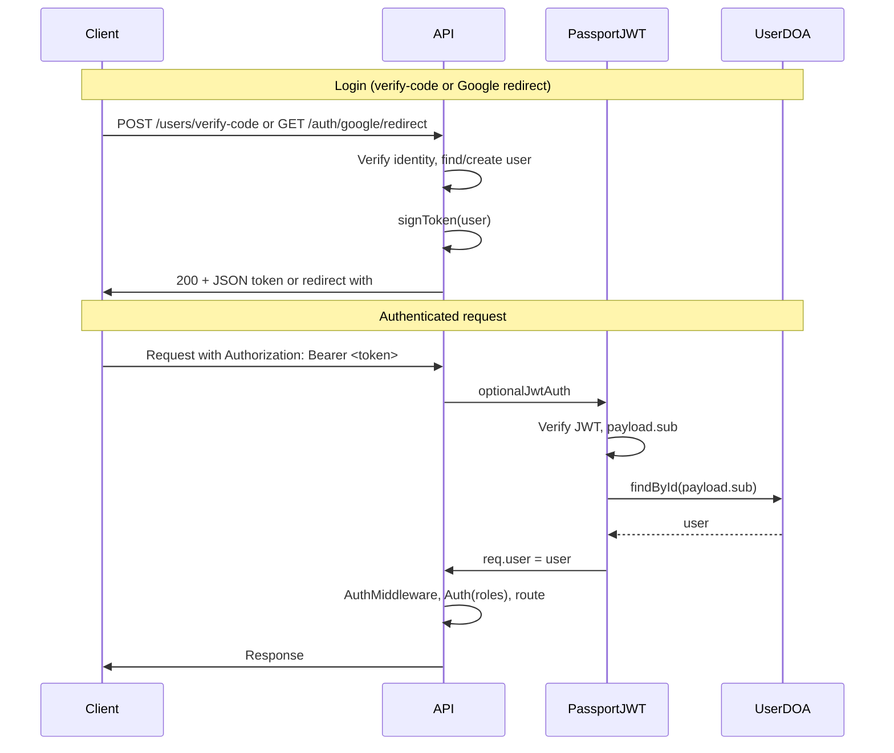

## JWT authentication implementation

This document describes how the API uses **passport-jwt** for authentication: JWTs are issued on login and validated from the `Authorization: Bearer` header on each request. General API authentication is stateless (no server-side session). The only exception is a **temporary session** used during the Google OAuth redirect flow so the OIDC library can store state between the outbound redirect and the callback (see [Why session is used for Google OAuth](#why-session-is-used-for-google-oauth)).

### High-level behavior

- **Login returns a JWT**: After email code verification or Google OAuth, the server signs a JWT and returns it (in the JSON body or in the redirect URL). The client stores the token and sends it on subsequent requests.
- **`req.user` from JWT**: On every request, optional middleware extracts the JWT from `Authorization: Bearer <token>`, verifies it, loads the user from the database, and sets `req.user`. If no token or invalid token, `req.user` is left undefined.
- **AuthMiddleware**: Sets `req.userRoles` from `req.user` (or `ANY_USER` when unauthenticated). Route-level `Auth(roles)` enforces role checks. No `req.isAuthenticated()` or session.

### Why session is used for Google OAuth

We use **JWT for authentication** (Bearer token on each request). Session is **not** used for “is the user logged in?” — that is entirely JWT. Session is required only for the **Google OAuth redirect flow**:

1. **Outbound:** User hits `GET /auth/google/login`. The server redirects the browser to Google and sends a **state** (and possibly nonce) for CSRF protection. The OIDC library must **store that state** somewhere so it can verify the callback.
2. **Callback:** User signs in at Google; the browser is redirected back to `GET /auth/google/redirect?state=...&code=...`. The server must look up the state it stored in step 1 and verify it matches.

The library we use (`passport-openidconnect`, behind `passport-google-oidc`) stores that state in the **session** by default. So:

- **Session** = short-lived storage only for the OAuth handshake (one redirect out, one redirect back). It is not used for authenticating normal API requests.
- **JWT** = how we authenticate requests after login. No session is involved for that.

Without `express-session`, the OIDC strategy throws: *“OpenID Connect requires session support. Did you forget to use `express-session` middleware?”*

### Dependencies and configuration

- **Packages**: `passport`, `passport-jwt`, `passport-google-oidc`, `jsonwebtoken`, `express-session` (used only for the Google OAuth redirect flow; see above).
- **Secret**: `jwtSecret` from `api/src/config.js` (env `JWT_SECRET` or `SESSION_SECRET`). Used to sign and verify JWTs with algorithm `HS256`. Session uses `SESSION_SECRET` or falls back to `JWT_SECRET` (see `sessionConfig` in `api/src/config.js`).
- **Token lifetime**: 7 days (configurable via `JWT_EXPIRY_DAYS` in `api/src/passport.js`).

### Issuing JWTs

- **`signToken(user)`** (exported from `api/src/passport.js`):
  - Payload: `{ sub: user.userId }`.
  - Options: `algorithm: "HS256"`, `expiresIn: "7d"`.
  - Used by:
    - **POST /users/verify-code**: After finding/creating user and updating last login, responds with `{ success, message, token, user }`. Client must store `token` and send it as `Authorization: Bearer <token>`.
    - **GET /auth/google/redirect**: After storing Google tokens in the provider table, signs a JWT and redirects to `{BASE_URL}#token=<jwt>`. Frontend reads the hash fragment, stores the token, and removes it from the URL.

### Validating JWTs on each request

- **JWT strategy** (in `api/src/passport.js`):
  - **Extraction**: `ExtractJwt.fromAuthHeaderAsBearerToken()` — reads `Authorization: Bearer <token>`.
  - **Verification**: `secretOrKey: jwtSecret`, `algorithms: ["HS256"]`.
  - **Verify callback**: On success, `UserDOA.findById(payload.sub)` loads the user and calls `done(null, user)`; otherwise `done(null, false)` or `done(err)`.

- **Optional JWT middleware** (`optionalJwtAuth`, in `api/src/passport.js`):
  - Runs after `passport.initialize()` in `api/src/index.js`.
  - Calls `passport.authenticate("jwt", { session: false }, (err, user) => { req.user = user ?? undefined; next(); })`.
  - Never sends 401: if the token is missing or invalid, `req.user` is set to `undefined` and the request continues. This allows routes like `GET /users/me` to return 404 when unauthenticated and protected routes to rely on `Auth(roles)` (403 when role check fails).

### Middleware order in index.js

1. `express.json()`, `express.urlencoded()`, `cookieParser()`
2. `express-session` — required by passport-openidconnect for the Google OAuth state; not used for JWT auth
3. `passport.initialize()`
4. `optionalJwtAuth` — sets `req.user` when a valid Bearer token is present
5. `requestLogger`, `AuthMiddleware` (sets `req.userRoles`), `responseSanitizer`
6. Routes, then `NotFoundMiddleware`, `ErrorHandlerMiddleware`

We do **not** use `passport.session()` or serialize the user into the session. Session is only used by the OIDC strategy to store OAuth state during the redirect flow.

### AuthMiddleware and authorization

- **AuthMiddleware**: Computes `req.userRoles` from `req.user` (bitmask: `ANY_USER`, `SUBSCRIBED_USER`, `ADMIN`; `SAME_USER` is added per-route by `Auth(allowedRoles)` when the path has `:userId` and it matches the current user).
- **Auth(allowedRoles)**: Ensures `req.userRoles` includes one of the allowed roles; otherwise responds with 403.
- **authenticateUser** (optional helper): Returns 401 if `!req.user`. Use when a route must require a logged-in user without caring about roles.

### Logout

- **POST /users/logout**: Returns `{ success: true, message: "Logged out successfully" }`. There is no server-side session to destroy for *authentication* (the OAuth session is transient and only used during the login redirect). The client must discard the stored JWT (e.g. clear memory or localStorage). Optional future: token blacklist for early invalidation.

### Frontend / client contract

- After **email code login**: Client receives `{ token, user }` in the JSON body. Store `token` and send it on every authenticated request as `Authorization: Bearer <token>`.
- After **Google OAuth**: Client is redirected to `{BASE_URL}#token=<jwt>`. Read `token` from the hash (e.g. `window.location.hash`), store it, then remove the hash so the URL is clean. Send `Authorization: Bearer <token>` on subsequent requests.
- **Logout**: Call `POST /users/logout` and then delete the stored token on the client.

### End-to-end flow summary

1. User logs in (Google OAuth or POST /users/verify-code).
2. Server authenticates, finds/creates user, and returns or redirects with a signed JWT.
3. Client stores the JWT and sends `Authorization: Bearer <token>` on each API request.
4. `optionalJwtAuth` verifies the JWT, loads user from DB, sets `req.user`.
5. `AuthMiddleware` sets `req.userRoles`; `Auth(roles)` enforces access; route handlers use `req.user`.

### Diagram

