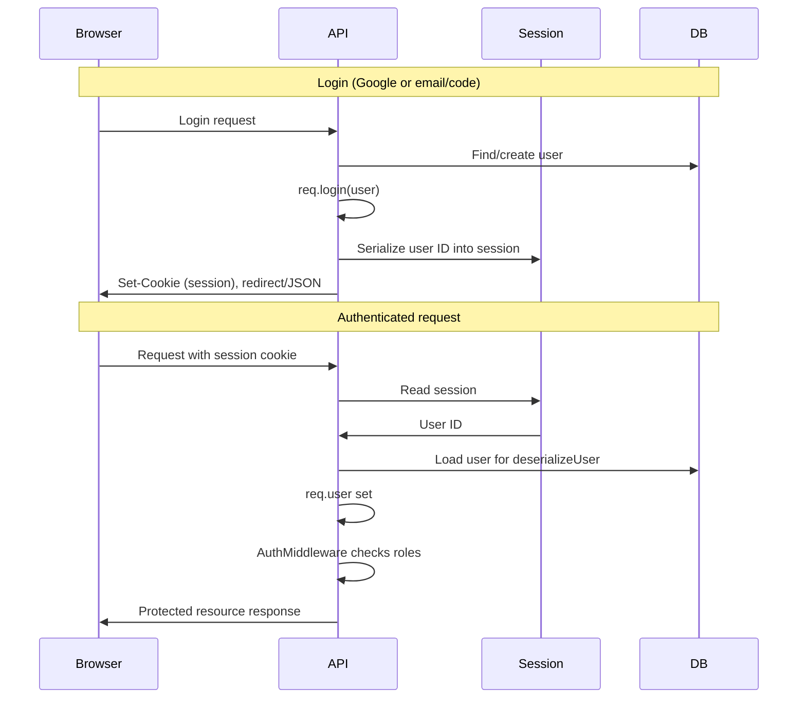

## Passport.js session strategy implementation

This document explains how Passport.js is used to provide session‑based authentication in the API and how it replaces the previous JWT‑based flow.

### High‑level behavior

- **Session holds the login**: once a user authenticates, Passport stores a small identifier in the session.
- **`req.user` from session**: on every request, Passport reads the session, deserializes the user, and populates `req.user`.
- **No JWT cookies**: the browser only sends a session cookie (e.g. `connect.sid`); there is no access/refresh token.
- **AuthMiddleware**: simply checks that the user is authenticated and then enforces authorization rules.

### Serialization and session middleware

- A central Passport configuration defines `serializeUser` and `deserializeUser` (e.g. in `api/src/passport.js`).
- **Serialization**:
  - Stores a minimal object, typically `{ id: user.userid }`, in the session.
  - Keeps the session small and decoupled from schema changes.
- **Deserialization**:
  - Uses `UserDAO.findById(id)` (or similar) to load the current user from the database.
  - Passes the full user object to `done(null, user)` so it becomes `req.user`.
- In `api/src/index.js`:
  - `passport.initialize()` is added early in the middleware chain.
  - `passport.session()` is added after the session middleware so `req.user` is restored for each request.
- Session cookie `maxAge` is set to a longer duration (e.g. several days) to represent the login lifetime.

### Establishing the session on login

- **Google OAuth login** (`GoogleAuth` endpoint):
  - The callback/redirect route uses Passport with session enabled (no `session: false`).
  - After provider tokens are handled, the server calls `req.login(user, cb)` to establish the session.
  - The response redirects to the frontend; the browser receives a session cookie instead of a JWT.
- **Email + code login** (`LoginUser` endpoint):
  - After the code is verified and a user is created/fetched, `req.login(user, cb)` is called.
  - The API sends a JSON response, and the browser stores the session cookie from `Set-Cookie`.
- **Logout**:
  - Uses `req.logout(cb)` to clear the Passport session state.
  - Clears the session cookie with `res.clearCookie(...)`.

### AuthMiddleware with sessions

- `AuthMiddleware` no longer reads or verifies JWTs.
- It relies on Passport’s session handling:
  - If `!req.isAuthenticated()` or `!req.user`, it returns `401 Unauthorized`.
  - If `req.user` is present, it passes control to role‑based checks.
- Existing role constants (e.g. `ANY_USER`, `ADMIN`, `SAME_USER`) still operate on `req.user` as before.
- Net effect: **authentication = “has valid session”**, **authorization = “has required role”**.

### Frontend behavior

- API calls that require authentication are made with `credentials: 'include'` so the browser sends the session cookie.
- No Bearer token headers are needed for normal web usage.
- Helper methods that previously attached JWTs are either unused or optional; the canonical auth mechanism is the session cookie.

### Session store and cookie

- Development may use the default in‑memory store.
- Production should use a persistent shared store (e.g. Postgres‑backed `connect-pg-simple`) so sessions survive restarts and work across instances.
- The cookie name defaults to `connect.sid` but can be customized via the session configuration.

### End‑to‑end flow summary

1. User logs in (Google OAuth or email + code).
2. Server authenticates user and calls `req.login(user)`.
3. Passport serializes the user ID into the session; `express-session` issues a session cookie.
4. On subsequent requests, the browser sends the session cookie.
5. `passport.session()` reads the session, deserializes the user, and sets `req.user`.
6. `AuthMiddleware` checks `req.user` and role requirements before allowing access.

### Diagram

